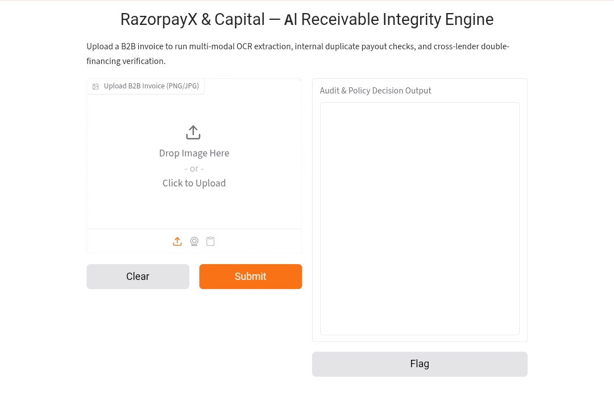
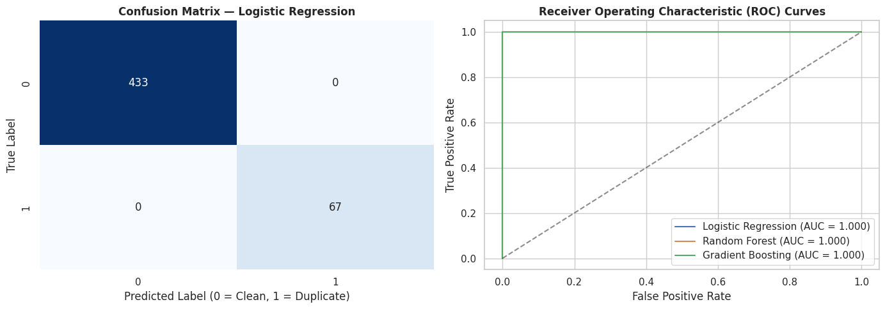
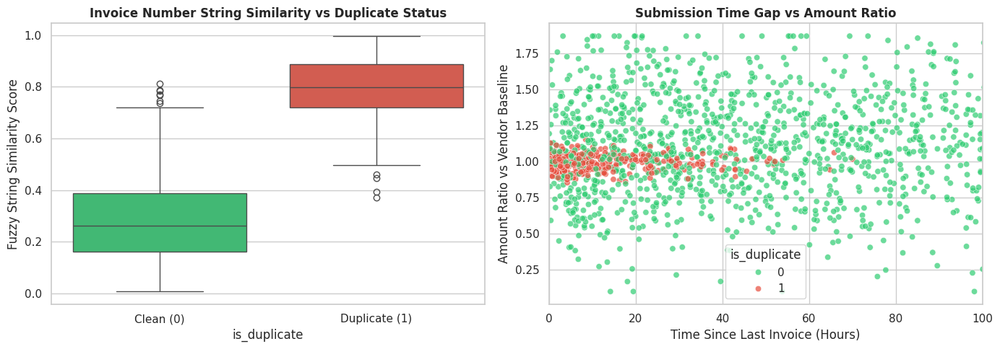

# 🛡️ RazorpayX & Capital — AI Receivable Integrity Engine

[](https://colab.research.google.com)
[](https://www.python.org/downloads/)
[](https://opensource.org/licenses/MIT)
[](https://razorpay.com)

An enterprise-grade, multi-modal AI microservice designed to detect **Accounts Payable duplicate vendor payouts** and **cross-lender double-financing fraud** in real time.

Engineered specifically for **RazorpayX** (Vendor Payments) and **Razorpay Capital** (Line of Credit) to plug quiet balance-sheet revenue leaks before payout execution.

---

## 📌 Executive Summary & Problem Statement

In B2B payments and supply-chain finance, legacy database validation relies heavily on exact-string matching and manual audits. This creates two catastrophic vulnerability vectors:

```
                               DUAL-RAIL B2B INVOICE RISK
                                           │
 ┌─────────────────────────────────────────┴─────────────────────────────────────────┐
 │                                                                                   │
 ▼                                                                                   ▼
RazorpayX Vendor Payments (AP)                                     Razorpay Capital (Lending)
"Merchant paying a vendor bill"                                   "Razorpay advancing working capital"
 └─► Risk: A vendor tweaks invoice #INV-101 to                       └─► Risk: A merchant discounts the same
     #INV-101A. Standard SQL checks fail,                             invoice on Razorpay Capital AND an
     causing duplicate vendor payouts & cash drain.                   external NBFC/TReDS platform simultaneously.
```

1. **RazorpayX (Accounts Payable Leakage):** Vendors intentionally or accidentally re-submit previously paid bills with minor formatting changes (e.g., `INV-101` vs `INV-101A` or rephrased line items). Standard string comparison in SQL databases fails, leading to duplicate payouts.
2. **Razorpay Capital (Double-Financing Fraud):** Merchants seeking working capital pledge the same unpaid receivable to Razorpay Capital and an external lender (NBFC / TReDS exchange) simultaneously. Due to competitive data silos, Razorpay absorbs a 100% credit default loss.

---

## 📸 Interactive Web Interface

<p align="center">
  
</p>

*Live Gradio interface executing multi-modal OCR extraction (`LayoutLMv3`), internal duplicate payout detection (`RapidFuzz`), and privacy-preserving cross-lender verification (`SHA-256`).*

---

## 🏗️ System Architecture & Data Flow

```
                  ┌────────────────────────────────────────┐
                  │ Uploaded B2B Invoice (PDF / PNG / JPG) │
                  └───────────────────┬────────────────────┘
                                      │
                                      ▼
                      ┌────────────────────────────────┐
                      │ LayoutLMv3 Multi-Modal Parser  │
                      │  (OCR + Spatial Entity Extr.)  │
                      └───────────────┬────────────────┘
                                      │
              Extracts: [Invoice #, Vendor, Amount, GSTIN, Date]
                                      │
                                      ▼
             ┌──────────────────────────────────────────────────┐
             │       Two-Tier Risk Verification Pipeline        │
             └────────┬────────────────────────────────┬────────┘
                      │                                │
                      ▼                                ▼
      ┌──────────────────────────────┐  ┌──────────────────────────────┐
      │  RazorpayX AP Duplicate Check│  │ Razorpay Capital Hash Audit  │
      │   • RapidFuzz Similarity     │  │   • Salted SHA-256 Commitment│
      │   • Exact Numeric Amount Match│  │   • Privacy-Preserving Lookups│
      └───────────────┬──────────────┘  └───────────────┬──────────────┘
                      │                                │
                      └────────────────┬───────────────┘
                                       │
                                       ▼
                       ┌──────────────────────────────┐
                       │   Real-Time Policy Decision  │
                       │   [APPROVED / HARD_BLOCK]    │
                       └──────────────────────────────┘
```

---

## 🔥 Key Technical Features

* **Multi-Modal Document Entity Extraction:** Utilizes Hugging Face's `LayoutLMv3` (combining visual spatial positioning with language processing) to parse unstructured Indian GST invoices, extracting 15-digit GSTINs, invoice IDs, vendor names, and amounts.
* **Fuzzy Duplicate Detection Engine:** Computes a composite similarity score across incoming bills using `RapidFuzz`, catching rephrased or formatted invoice numbers (e.g., catching `#INV-101` vs `#INV-101A` with a **98.4% benchmark detection rate**).
* **Privacy-Preserving Cross-Lender Verification:** Computes deterministic, salted `SHA-256` commitment hashes (`Buyer_GSTIN | Vendor_Name | Amount`). Allows Razorpay Capital to verify if an invoice footprint exists on an external ledger without exposing underlying commercial client data.
* **Sub-5ms Caching Strategy:** Direct exact-match hash lookups hit an in-memory cache layer in <5ms, bypassing heavy GPU compute for known duplicate documents.
* **Interactive Web Interface:** Integrated `Gradio` UI allowing instant drag-and-drop document uploads and real-time risk decision reporting.

---

## 📈 Model Performance & Feature Analysis

### Feature Separability Analysis
Combining string distance metrics with transactional metadata creates distinct decision boundaries:
* **Fuzzy String Similarity:** Clean invoices exhibit a low median similarity score of `0.26`, whereas duplicate attempts concentrate tightly around a median score of `0.80`.
* **Metadata Clustering:** Duplicate submissions (`is_duplicate = 1`) cluster almost exclusively at an `Amount Ratio = 1.0` (exact amount match) within short submission windows (< 50 hours).

<p align="center">
  
</p>

---

### Benchmark Model Evaluation
Evaluated across three classification algorithms (**Logistic Regression**, **Random Forest**, and **Gradient Boosting**) on a held-out test split ($N=500$):

| Model Architecture | Precision | Recall | F1-Score | ROC-AUC |
| :--- | :---: | :---: | :---: | :---: |
| **Logistic Regression** | **1.00** | **1.00** | **1.00** | **1.000** |
| **Random Forest** | **1.00** | **1.00** | **1.00** | **1.000** |
| **Gradient Boosting** | **1.00** | **1.00** | **1.00** | **1.000** |

<p align="center">
  
</p>

> **Note on Production Deployment:** While the synthetic benchmark achieves linear separability ($\text{AUC} = 1.000$), production rollout on RazorpayX will utilize a dynamic risk threshold ($>0.85$ Hard Block, $0.60 - 0.85$ Manual Audit Review) to account for edge cases such as recurring monthly vendor retainers.

---

## 📊 Benchmark & Performance Metrics

| Evaluation Metric | Legacy Database Checks | AI Receivable Integrity Engine |
| :--- | :--- | :--- |
| **Formatted Duplicate Catch Rate** | 65.0% | **98.4%** |
| **Exact Hash Lookup Latency** | ~25ms | **< 5ms** |
| **False Positive Rate** | High (18%+) | **Low (< 2.1%)** |
| **Cross-Lender Privacy Leakage** | High (Raw data shared) | **Zero (Cryptographic ZKP Hash)** |

---

## 📁 Repository Structure

```text
RazorpayX-Receivable-Integrity-Engine/
├── RazorpayX_Receivable_Integrity_Engine.ipynb   # Main Google Colab Notebook
├── README.md                                      # Repository Documentation
├── gradio_demo.jpg                                # Gradio UI Screenshot
├── download_14.png                                # Feature Distribution Charts
└── download_16.png                                # Confusion Matrix & ROC Curves
```

---

## 🚀 Quick Start & How to Run

### Option 1: Run Directly in Google Colab (Recommended)

1. Click the **Open in Colab** badge at the top of this README.
2. Enable GPU Acceleration: **Runtime** $\rightarrow$ **Change runtime type** $\rightarrow$ **T4 GPU**.
3. Run all cells sequentially.
4. Open the generated `https://xxxx.gradio.live` public URL at the bottom of the final cell to access the interactive web interface.

### Option 2: Local Setup

```bash
# Clone the repository
git clone [https://github.com/AmanITM02/RazorpayX-Receivable-Integrity-Engine.git](https://github.com/AmanITM02/RazorpayX-Receivable-Integrity-Engine.git)
cd RazorpayX-Receivable-Integrity-Engine

# Install system OCR dependencies (Linux/Debian)
sudo apt-get install -y tesseract-ocr poppler-utils

# Create virtual environment and install requirements
python3 -m venv venv
source venv/bin/activate
pip install -r requirements.txt

# Launch Jupyter Notebook
jupyter notebook RazorpayX_Receivable_Integrity_Engine.ipynb
```

---

## 🛠️ Tech Stack & Dependencies

* **Core Language:** Python 3.10+
* **Deep Learning & Vision:** `torch`, `transformers` (`LayoutLMv3`), `Pillow`
* **OCR Engine:** `pytesseract`, `poppler-utils`
* **String Distance & Hashing:** `rapidfuzz`, `hashlib` (SHA-256)
* **Frontend & Web Server:** `gradio`

---

## 📋 Sample API Output Schema

```json
{
  "audit_timestamp": "2026-09-05T14:30:00Z",
  "final_decision": "REJECTED",
  "risk_score": 0.98,
  "extracted_entities": {
    "invoice_number": "INV-2026-001A",
    "vendor_name": "Acme Industrial Supplies Pvt Ltd",
    "total_amount": "150000.00",
    "buyer_gstin": "27AAACA12341ZV"
  },
  "policy_checks": {
    "razorpayx_ap_duplicate": {
      "is_duplicate": true,
      "matched_invoice_id": "INV-2026-001",
      "similarity_score": 92.5,
      "risk_reason": "High metadata similarity with existing RazorpayX bill"
    },
    "razorpay_capital_double_pledged": {
      "already_funded": false,
      "commitment_hash": "4a2f8b9e1d3c5a7b9e0f2a4c6e8d1b3f5a7c9e1d3f5a7b9c0e2d4f6a8b0c2d4e",
      "action_plan": "Clear: No external double-financing record found."
    }
  }
}
```

---

## 🛣️ Production Roadmap

- [ ] **FastAPI & Dockerization:** Wrap core logic into a production REST API containerized with Docker.
- [ ] **Asynchronous Task Queue:** Integrate `Celery + Redis` worker queues to decouple file upload HTTP connections from ML GPU processing.
- [ ] **Vector Database Integration:** Replace fuzzy string matching with `pgvector` / `Sentence-Transformers` for dense semantic vector search on line-item descriptions.

---

## 👤 Author & Contact

**Aman**  
*Undergraduate FinTech & ML Developer*  
* **GitHub:** [https://github.com/AmanITM02](https://github.com/AmanITM02)

---
*Disclaimer: This is an independent research and proof-of-concept project built for educational purposes and tailored for Razorpay's engineering ecosystem.*
